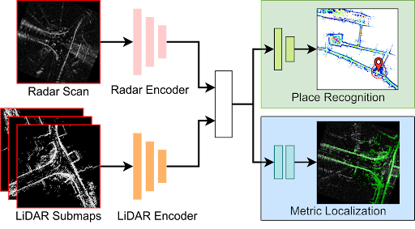

# RaLF
## Introduction
This repository is the official implementation of our paper accepted at **IEEE ICRA 2024** [[arXiv]](https://arxiv.org/pdf/2309.09875.pdf)

>RaLF: Flow-based Global and Metric Radar Localization in LiDAR Maps
>[Abhijeet Nayak](https://github.com/abhijeetknayak), [Daniele Cattaneo](https://rl.uni-freiburg.de/people/cattaneo), [Abhinav Valada](https://rl.uni-freiburg.de/people/valada)



While camera and LiDAR-based approaches have been extensively investigated for localization, they are affected by adverse illumination and weather conditions. Therefore, radar sensors have recently gained attention due to their intrinsic robustness to such conditions. We propose RaLF, a novel deep neural network-based approach for localizing radar scans in a LiDAR map of the  environment, by jointly learning to address both place recognition (global) and metric localization. 

RaLF is composed of radar and LiDAR feature encoders, a place recognition head that generates global descriptors, and a metric localization head that predicts the 3-DoF transformation between the radar scan and the map. We tackle the place recognition task by learning a shared embedding space between the two modalities via cross-modal metric learning. Additionally, we perform metric localization by predicting pixel-level flow vectors that align the query radar scan with the LiDAR map. 

## Table of Contents
1. [Introduction](#RaLF)
2. [Install](#install)
3. [Data Preparation](#data-preparation)
4. [Training](#training)
5. [Evaluation](#evaluation)
6. [Download](#download)
7. [Citation](#citation)


## Install
We tested our code with the following configuration:

- Ubuntu 18.04, Python 3.8
- Pytorch 1.10.2, CUDA 11.3

Run the following commands to create a conda environment with the required libraries:

```bash
git clone https://rlgit.informatik.uni-freiburg.de/cattaneo/radar_lidar_loc.git
cd radar_lidar_loc
conda create -n ralf python=3.8
conda activate ralf
```

Install [PyTorch](https://pytorch.org/) (make sure to use the correct CUDA version).

Install the required packages with the following command:

```bash
pip install -r requirements.txt
```

## Data Preparation

We use multiple datasets in our approach --- namely [Oxford Radar Robotcar](https://oxford-robotics-institute.github.io/radar-robotcar-dataset/), [Mulran Kaist](https://sites.google.com/view/mulran-pr/dataset) and [Boreas](https://www.boreas.utias.utoronto.ca/#/).
| Dataset   |      Train Sequences      |  Test Sequences |
|----------|-------------|------|
| Oxford |  2019-01-18-12-42-34, <br> 2019-01-18-14-14-42, <br> 2019-01-18-14-46-59, <br>2019-01-18-15-20-12 | Map: 2019-01-18-15-20-12 <br> Query: 2019-01-18-14-46-59 |
| Mulran Kaist |    KAIST02, KAIST03   |   Map: KAIST02, Query: KAIST03 |
| Boreas | - |    Map: 2021-05-13-16-11 <br> Query: 2021-05-06-13-19 |

For the train and test splits in each of these sequences, please have a look at our [paper](https://arxiv.org/pdf/2309.09875.pdf).

Follow the following steps to prepare input data to our network:
- ### **Map Generation**:
  - We use the lidar samples to create a map for each sequence in the dataset
  - First, set the correct data paths in the config file: **utils/config.py**
  - Run the script for the dataset you want to use:
  ```bash
  python -m map_generation.map_oxford
  python -m map_generation.map_kaist
  python -m map_generation.map_boreas
  ```
  - After running these scripts, you can find the map stored in each sequence as an npz file: **downsampled_map.npz**

- ### **Radar Bird's eye-view (BEV) generation**:
  - Each dataset provides radar data in the form of a polar image. Our network utilizes a Bird's eye-view (BEV) image as the input
  - Convert each polar image into a BEV image of size 256 * 256 pixels and an image resolution of 0.5m/pixel
  - If not already done, set the correct data paths in the config file: **utils/config.py**
  - Run the script for the dataset you want to use:
  ```bash
  python -m radar_bev_gen.radar_oxford
  python -m radar_bev_gen.radar_kaist
  python -m radar_bev_gen.radar_boreas
  ```

  After running these scripts, you will notice that a new folder **radar_bev** is created in each sequence directory. This folder contains the BEV images that will be used for training/validation.

- ### **Train/Test Split**:
  - We store the training/validation data in the form of json files. The following information is stored in these files:
    1. Sequence info - Information about where the sample can be found
    2. Pose information: 6D pose information in the form of a 4*4 matrix
    3. Ground truth position: Location of the sample in the world coordinate frame. This is used to determine positive and negative samples to an anchor sample
  - If not already done, set the correct data paths in the config file: **utils/config.py**

  - To create the train/validation json files, run the following for the dataset you want to use:
  ```bash
  python -m train_val_split.train_val_split_oxford
  python -m train_val_split.train_val_split_kaist
  python -m train_val_split.train_val_split_boreas
  ```
  For the Oxford dataset, the validation region is chosen based on prior work in the field of place recognition.
  For the Mulran-Kaist dataset, the validation split is chosen arbitrarily. 
  As mentioned in our paper, we use the entire region of the Boreas dataset as our test split. 

  After running these scripts, the json files are created in the respective dataset directory. A unique validation/test file is created for each sequence. This enables cross-sequence validation of our approach that provides an accurate generalization score.

  Additionally, each query should have at least one data sample in the map that exists within the threshold distance from the query location. 
  We have written this script to only modify the boreas query and map files. Add the correct query and map files to **utils/config.py**. To select query samples that satisfy this criteria, run the following script:
  ```bash
  python -m train_val_split.testdata_check_and_update
  ```
  This creates new query and map json files. Make sure that you update utils/config.py with the new query and map files!

This concludes the data preparation steps that are required to train/validate our approach.

## Training
Training scripts will be released soon.

## Evaluation
Again, make sure that you have run [data preparation](#data-preparation) before hand.
We provide an evaluation script that only evaluates the model on the Boreas dataset. Therefore, ensure that the correct query and map json files are set in 'utils/config.py'.

To evaluate a model, set the correct model path in the **load_model** attribute in the `ralf_localization/config/test.json` file. Then run the script:
```bash
python -m ralf_localization.validation
```

## Download
To download a trained model, use this [link](https://drive.google.com/file/d/1QXIlBwrcO6_LaFBgbAgE2UPr_L6KrjX5/view?usp=sharing)

## Citation
If you find our work useful, please cite our paper:
```
@INPROCEEDINGS{nayak2024ralf,
  title={RaLF: Flow-based Global and Metric Radar Localization in LiDAR Maps},
  author={Nayak, Abhijeet and Cattaneo, Daniele and Valada, Abhinav},
  booktitle={2024 IEEE International Conference on Robotics and Automation (ICRA)},
  year={2024}
}
```
